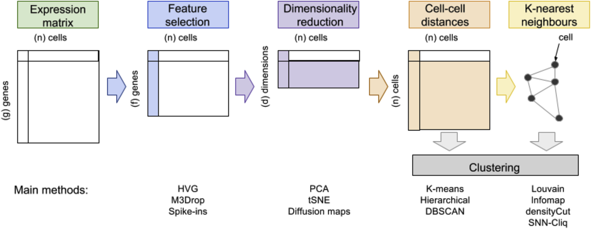
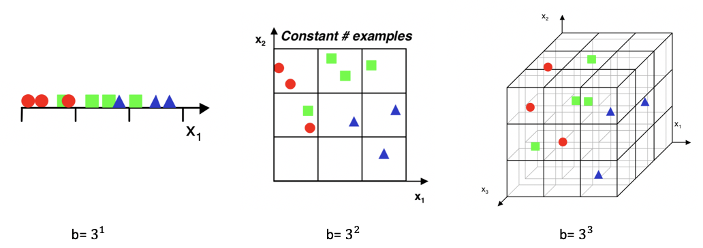
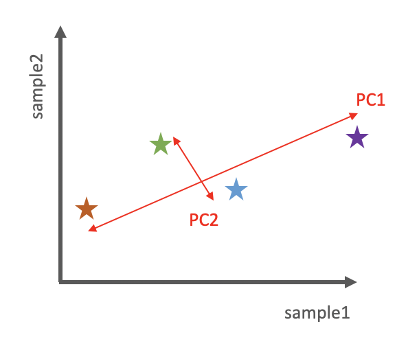
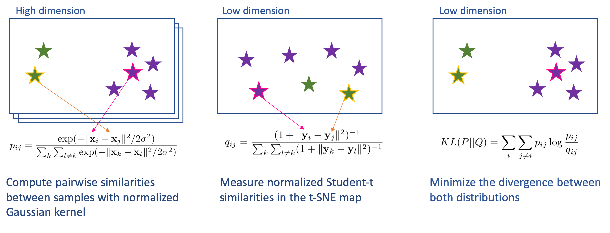
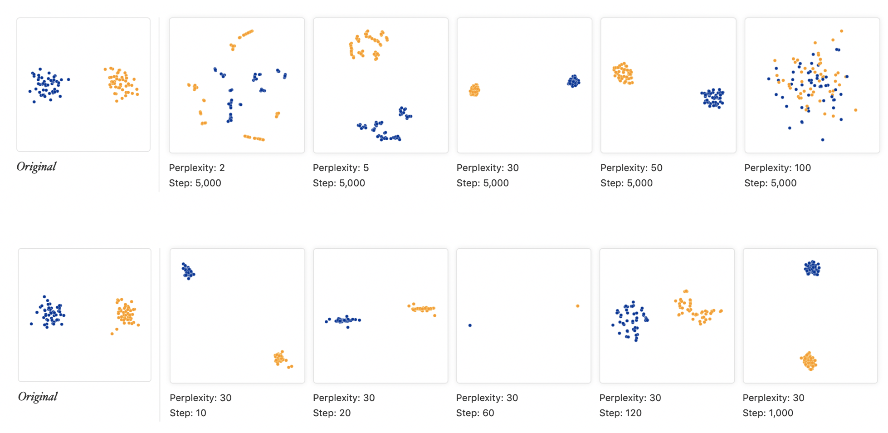
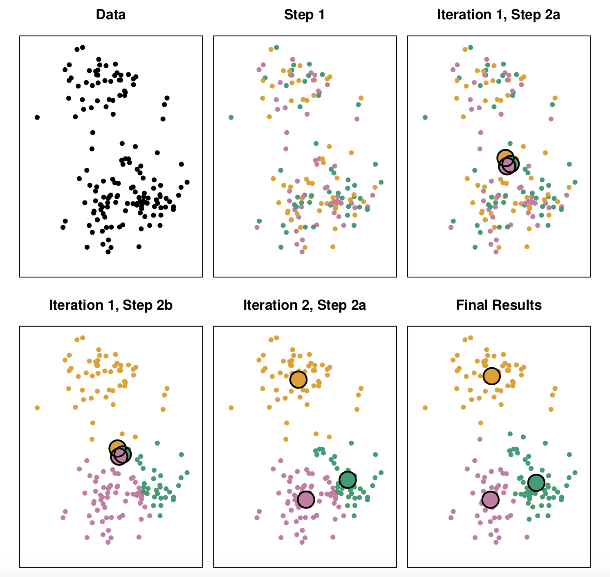
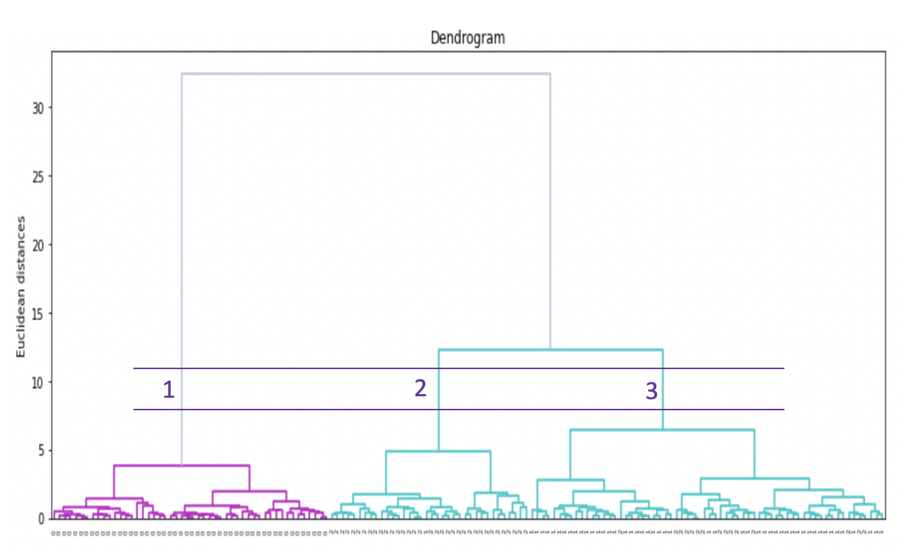

# Single Cell Course 

**Our aim is to extract biologically meaningful insights from scRNA-seq data.**

Image credit: [Andrews and Hemberg. "Identifying cell populations with scRNASeq." Mol Asp of Med. 2018](https://doi.org/10.1016/j.mam.2017.07.002)

# 1. Dimensionality reduction & visualization 

***Why do we need dimesionality reduction?***

In a scRNA-seq experiment, each cell (sample) is represented with features that are measured values of gene expressions. Thus, number of features (i.e. genes) determines the dimensionality which is around thousands for mammalian samples. Working with high-dimensional samples are difficult for many reasons: 

   + Difficulty in visualization and interpretation
   + Redundant and irrelavant features
   + Curse of dimensionality

***What is curse of dimensionality?***

Imagine a 3-class classification problem where we have three types of samples and we will classify them based on a single feature (x axis), two features (x,y axes) and three features (x,y,z axes) [[2]](http://research.cs.tamu.edu/prism/lectures/iss/iss_l10.pdf). A basic approach to classify samples can be dividing the feature space into equal bins and computing the number of samples for each class at each bin. Then, a new sample can be assigned to the class that has the most number samples in its corressponding bin.

    

   Image credit: [Ricardo Gutierrez-Osuna, Intelligent Sensor Systems](http://research.cs.tamu.edu/prism/lectures/iss/iss_l10.pdf)

We can observe that as the number of features (i.e. dimensions) increases, the number of bins also increases exponentially. With the same number of samples, 3D space becomes scarce compared to 1D space. Therefore, in order to make meaningful predictions, the number of samples should also increase with dimensionality to maintain the density in bins. Otherwise, ==above a threshold of maximum features, the performance of the learning algorithm will decrease rather than improve for a given sample size== [[2]](http://research.cs.tamu.edu/prism/lectures/iss/iss_l10.pdf). So, how do we deal with this?

***Feature selection vs feature extraction***

We can reduce dimensions with two general approaches [[1]](https://doi.org/10.1016/j.mam.2017.07.002) :

   * **Feature selection:** *filters* irrelevant or redundant features (e.g. uninformative genes) from the original feature set. 
	$$ [x_1, x_2, ..., x_n] -> [x_1, x_2, ..., x_k] $$
   
   * **Feature extraction:**  *projects* data into a low-dimensional space by preserving important characteristics (i.e. creating "embeddings"). Keep in mind that we no longer have the original features in the new embedding.
   $$ [x_1, x_2, ..., x_n] -> [y_1, y_2, ..., y_k] $$

Reducing the dimensions, we can obtain a summary of the data that is able to explain its characterics with fewer ==discriminative== and ==non-dependent== features and we can visualize a cell as a point in a two-dimensional (2D) and three-dimensional (3D) spaces, respectively. We can also expect a decrease in the noise and a visible increase in the computatinal speed. In this projected cells with similar characterisctics will gather close to eacher whereas cells that are different appear apart. Now let us look at popular feature extraction techniques that are frequently used in scRNA-seq studies. 

## 1.1 Principal Component Analysis (PCA)

### Background

Principal components analysis is an unsupervised linear projection technique that transforms complex high-dimensional ($n$) data into lower-dimensional form ($k$) while keeping important information (i.e. patterns, trends etc.). The high-dimensional data is projected onto lower dimensions called ==principal components (PCs)== such that the data can  be summarized by limited number of PCs.  PCA is performed in three main steps:

   * Covariance matrix of the original data is computed.
   * Eigenvalue decomposition is performed on the covariance matrix.
   * The PCs are the eigenvectors of the covariance matrix with the largest eigenvalues. 

   
    
   The first PC component should capture the largest variation across samples, the second PC should capture the remaining largest variation and be uncorrelated with the previous PC and so on. Thus, we can think of the PCs as geometrically orthogonal [[3]](http://fortinlab.bio.uci.edu/FortinLab/Teaching_files/Stats/POS_Principal_component_analysis.pdf). 

### How many PCs should be chosen?

When applying dimensionality reduction techniques for downstream analysis (e.g. other than visualization purposes) it might not always be obvious how many PCs should be chosen that can summarize the data. We already know that earlier PCs explain the most of the variance in the data, whereas we expect that possible technical or biological noise in the data is in the later PCs. We can look at the explained variance by each PCs and overall cumulative contribution above $80\%$ is good enough. [[ref]]()?????

### Limitations

   * PCA assumes that data is normally distributed and the underlying data structure is linear. These assumptions might not always be true for scRNA-seq data. 

   * The goal is to create PCs that can capture the greatest variance and not necesserialy identifying sub-groups [[3]](http://fortinlab.bio.uci.edu/FortinLab/Teaching_files/Stats/POS_Principal_component_analysis.pdf). 

#### Practise

   * [dimensionality_reduction.ipynb](dimensionality_reduction.ipynb)

#### Further sources

   * [A nice video explanation of PCA on biological context](https://www.youtube.com/watch?v=_UVHneBUBW0)

## 1.2. t-Distributed Stochastic Neighbor Embedding (t-SNE) 

### Background

t-SNE, unlike PCA, is a nonlinear technique that projects the high-dimensional distances between data points into conditional probability of similarities.  t-SNE generates a Gaussian probability distribution in the high dimensional space that defines the relationships between neighbor datapoints. Then, it aims to generate that probability distribution in the low dimensional space so that distances between datapoints remain as close to the original and close neighbors remain close to each other. To achieve this and avoid ==crowding==, instead of Gaussian, it uses student t-distribution. [[4]](https://doi.org/10.1038/s41467-019-13056-x). Because t-distribution have a fatter tail than Gaussian and the distance between the points in the lower dimension becomes more visible. 

    

Image credit: [Laurens van der Maaten, "Do's and Don'ts of using t-SNE to Understand Vision Models
." Interpretable Machine Learning for Computer Vision Workshop. 2018.](http://deeplearning.csail.mit.edu/slide_cvpr2018/laurens_cvpr18tutorial.pdf)  

>  $\sigma_i$ is the variance of the Gaussian that is centered on datapoint $x_i$. SNE performs a binary search for the value of $\sigma_i$ that produces a $P_i$ with a fixed perplexity in which $P_i$  represents the conditional probability distribution over all other datapoints given datapoint $x_i$ . The reason $\sigma_i$ is dependent on $x_i$ that we want $\sigma_i$  to be small for points in densely populated areas and large for sparse areas. Please refer to [(Maaten &  Hinton, "Visualizing data using t-SNE." JMLR, 2008)](http://www.jmlr.org/papers/volume9/vandermaaten08a/vandermaaten08a.pdf) for detailed explaination of the t-SNE algorithm. 

 ==Perplexity==  is a hyper-parameter that is specified by user and it controls the effective number of neighbors. The typical values of perplexity suggested by the authors are between 5 and 50. Larger perplexities will take more global structure into account, whereas smaller perplexities will make the embeddings more locally focused.

### Limitations

   * Since t-SNE is a stochastic algorithm, applying tSNE to the same dataset might yield different results at each run. Even though these differences might not be significant, it is best to run the algorithm several times to make sure of obtaining stable results. t-SNE optimizes the embeddings directly using gradient descent. The cost function is non-convex though, meaning there is the risk of getting stuck in local minima. 

   * Although the authors claim that “the performance of t-SNE is fairly robust to changes in the perplexity”, it is a good practise to experiment with different perplexity values to determine the appropriate value for your own dataset. 

    

Image credit: [Wattenberg, et al., "How to Use t-SNE Effectively." Distill. 2016.](http://doi.org/10.23915/distill.00002) A very useful resource that explores how t-SNE behaves in different conditions.  

   * The authors of the method emphasize that t-SNE is only evaluated for visualization where data is reduced to either 2D or 3D. Thus, it is dubious how t-SNE will perform on the general dimensionality reduction task where dimensions > 3 [(Maaten &  Hinton, 2008)](http://www.jmlr.org/papers/volume9/vandermaaten08a/vandermaaten08a.pdf). Therefore, a common practice in scRNA-seq studies is to use either a linear (e.g. PCA) or non-linear (e.g. ) to reduce dimensions and then feed the new low-dimensional data to t-SNE 

   * In t-SNE, while within cluster distances are meaningful, between cluster similarities might not indicate the real characteristics of the data. 

#### Practise
   * [dimensionality_reduction.ipynb](dimensionality_reduction.ipynb)

#### Further reading

   * [Video: how t-SNE works](https://www.youtube.com/watch?v=NEaUSP4YerM)
   * [A great blog post on using t-SNE on scRNA-seq](https://towardsdatascience.com/how-to-tune-hyperparameters-of-tsne-7c0596a18868)
   * [Another great blog post t-SNE explained](https://mlexplained.com/2018/09/14/paper-dissected-visualizing-data-using-t-sne-explained/)

## 1.3. Uniform Manifold Approximation and Projection (UMAP) 

### Background

UMAP (Uniform Manifold Approximation and Projection) is a novel manifold learning technique for dimension reduction [(Leland et al., 2018)](https://arxiv.org/abs/1802.03426)

### Limitations

**Practise:** [dimensionality_reduction.ipynb](dimensionality_reduction.ipynb)

#### Further reading

   * [ref1](https://www.nature.com/articles/nbt.4314)

# 2. Clustering 

**Why do we need clustering?**

Clustering is an unsupervised procedure that aims to identify homogeneous subgroups in a given dataset. Clustering algorithm can be based on distance between datapoints or a probability distribution model. Most of the clustering algorithms require number of clusters ($k$) as a hyper-parameter since it is not known a priori [(Qi et al., 2019).](https://doi.org/10.1093/bib/bbz062) In scRNA-seq context, clustering is an important procedure to identify and characterize cell-populations. These populations could be different cell-types (e.g. ) or identical cells in different states (e.g. ) [(Andrews & Hemberg, 2018)](https://doi.org/10.1016/j.mam.2017.07.002).

## 2.1 K-means

### Background

K-means is one of the most popular and easy-to-understand clustering algorithms. It requires input $k$, and then our aim is to minimize the dissimilarity within each cluster where dissimilarity is measured by distance between datapoints. Major steps can be summarized as:

   * Randomly assign each sample to one of the $k$ clusters.
   * Iterate following two steps until the clusters are stable:
      - (1) Compute the centroid of each cluster $m$ which is the average of all samples in that cluster.
      $$
      x_{m,j} = \frac{1}{|C_m|} \sum_{i e C_m}{x_{i,j}} \text{for} j=1,...,p
      $$
      - (2) Compute the distances of each sample to the centroids and assign the sample to the nearest centroid.

    

Image credit: [Guenther Walther, STATS 202: Data mining and analysis, Stanford University, 2019.](http://web.stanford.edu/class/stats202/content/lec4-cond.pdf)   

A common practise is to perform dimensionality reduction to the original dataset and then apply K-means algorithm to identify clusters. 

### Limitations

   * At the beginning of the algorithm, K-means randomly initializes centroids, therefore we might end up with different clusters at each run.
   * Number of clusters must be pre-determined.

#### Practise

   * [clustering.ipynb](dimensionality_reduction.ipynb)

#### Further reading

##  2.2. Hierarchical clustering

### Background
Hierarchical clustering is based on computing distances between samples and generates a dendogram of hierachical relationships. A dendogram is a tree where each leaf is a sample and the root is the cluster that contains all samples. Hierarchical clustering approaches are investigated under two categories: 

   * Agglomerative (*bottom-up*): starts from the bottom considering each leaf as a cluster and goes upwards while merging clusters together until it combines them all to the root. 
   * Divisive (*top-down*): starts from the root, a single cluster, then goes down to the leaves while separating each cluster on its way. 

  

 Image credit: [Pawan Jain, Hierarchical clustering Clearly Explained. 2019.](https://towardsdatascience.com/https-towardsdatascience-com-hierarchical-clustering-6f3c98c9d0ca)    

We will use agglomerative approach in our examples. scikit package also only uses agglomerative clustering. 

### Deciding number of clusters

    

 Dendogram for agglomerative clustering of *Iris* dataset    

### Limitations

   * Slow

#### Practise 

   * [clustering.ipynb](dimensionality_reduction.ipynb)

#### Further reading

   * [Ryan P. Adams, "Hirerachical Clustering." Elements of Machine Learning, Princeton University. 2018](https://www.cs.princeton.edu/courses/archive/fall18/cos324/files/hierarchical-clustering.pdf)

## 2.3. Graph-based clustering

### Background
### Limitations
#### Practise 

   * [clustering.ipynb](dimensionality_reduction.ipynb)

#### Further reading

