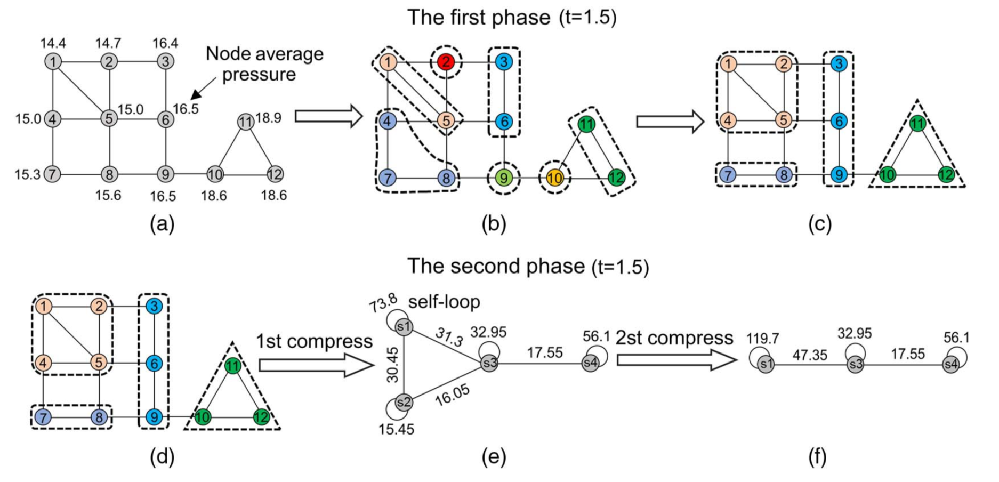

```{r setup, include=FALSE}
knitr::opts_chunk$set(echo = TRUE)
```


<sub>Image credit: [Andrews and Hemberg. "Identifying cell populations with scRNASeq." Mol Asp of Med. 2018](https://doi.org/10.1016/j.mam.2017.07.002) **Our aim is to extract biologically meaningful insights from scRNA-seq data.**</sub> 

# 1. Dimensionality reduction & visualization 

***Why do we need dimesionality reduction?***
<p style='text-align: justify;'>
In a scRNA-seq experiment, each cell (sample) is represented with features that are measured values of gene expressions. Thus, number of features (i.e. genes) determines the dimensionality which is around thousands for mammalian samples. Working with high-dimensional samples are difficult for many reasons: 

   + Difficulty in visualization and interpretation
   + Redundant and irrelavant features
   + Curse of dimensionality

***What is curse of dimensionality?***

Imagine a 3-class classification problem where we have three types of samples and we will classify them based on a single feature (x axis), two features (x,y axes) and three features (x,y,z axes) [(Gutierrez-Osuna, 2017)](http://research.cs.tamu.edu/prism/lectures/iss/iss_l10.pdf). A basic approach to classify samples can be dividing the feature space into equal bins and computing the number of samples for each class at each bin. Then, a new sample can be assigned to the class that has the most number samples in its corressponding bin.

  

   <sub>Image credit: [Ricardo Gutierrez-Osuna, Intelligent Sensor Systems](http://research.cs.tamu.edu/prism/lectures/iss/iss_l10.pdf)</sub>
<p style='text-align: justify;'>
We can observe that as the number of features (i.e. dimensions) increases, the number of bins also increases exponentially. With the same number of samples, 3D space becomes scarce compared to 1D space. Therefore, in order to make meaningful predictions, the number of samples should also increase with dimensionality to maintain the density in bins. Otherwise, above a threshold of maximum features, the performance of the learning algorithm will decrease rather than improve for a given sample size [(Gutierrez-Osuna, 2017)](http://research.cs.tamu.edu/prism/lectures/iss/iss_l10.pdf). So, how do we deal with this?


***Feature selection vs feature extraction***

We can reduce dimensions with two general approaches [(Andrews & Hemberg,2018)](https://doi.org/10.1016/j.mam.2017.07.002):

   * **Feature selection:** *filters* irrelevant or redundant features (e.g. uninformative genes) from the original feature set. 
	$$ [x_1, x_2, ..., x_n] -> [x_1, x_2, ..., x_k] $$
   
   * **Feature extraction:**  *projects* data into a low-dimensional space by preserving important characteristics (i.e. creating "embeddings"). Keep in mind that we no longer have the original features in the new embedding.
   $$ [x_1, x_2, ..., x_n] -> [y_1, y_2, ..., y_k] $$


Reducing the dimensions, we can obtain a summary of the data that is able to explain its characterics with fewer ```discriminative``` and ```non-dependent``` features and we can visualize a cell as a point in a two-dimensional (2D) and three-dimensional (3D) spaces, respectively. We can also expect a decrease in the noise and a visible increase in the computatinal speed. 

In this projected space, we expect cells with similar characterisctics gather close to eacher whereas cells that are different appear apart. Now let us look at popular feature extraction techniques that are frequently used in scRNA-seq studies. 

**Disclaimer:** [Iris data set](https://archive.ics.uci.edu/ml/datasets/iris)  will be used as an example for the sake of simplicity while explaining the following topics. The dataset comprises three flower types (i.e. classes), total 150 iris flowers and 4 measurements for each flower: sepal length, sepal width, petal length, petal width.


## 1.1 Principal Component Analysis (PCA)

### Background

Principal components analysis is an unsupervised linear projection technique that transforms complex high-dimensional ($n$) data into lower-dimensional form ($k$) while keeping important information (i.e. patterns, trends etc.). The high-dimensional data is projected onto lower dimensions called ```principal components (PCs)``` such that the data can  be summarized by limited number of PCs.  


```{r pca}
   PCA <- function(X) {
    # mean centered data
    x_norm <- as.matrix(scale(X, center=TRUE, scale = FALSE))
    # covariance matrix
    x_cov <- cor(x_norm)
    ## compute eigenvalues and eigenvectors of x_cov
    x_eigen = eigen(x_cov)
    
    return(x_eigen)
}
iris_x <- iris[1:4]
iris_eigen <- PCA(iris_x)

iris_eigen
```

The PCs are the eigenvectors of the covariance matrix with the largest eigenvalues. We can obtain a PC score for each data point in the dataset by projecting it to PC. 

```{r pca2, echo=FALSE, message=FALSE}
    library(ggplot2)
    library(cowplot)
    theme_set(theme_bw(base_size = 12))
    
    iris_res <- prcomp(iris_x, scale = TRUE)
    pca_df <- data.frame(iris_res$x, Species=iris$Species)
    
    # capture the rotation matrix in a data frame
    rotation_data <- data.frame(iris_res$rotation, variable=row.names(iris_res$rotation))
    arrow_style <- arrow(length = unit(0.03, "inches"), type = "closed") #  arrow style
   
    
    p1 <- ggplot(iris, aes(x=Sepal.Length, y=Sepal.Width, color=Species)) + geom_point()  
    p2 <- ggplot(iris, aes(x=Petal.Length, y=Petal.Width, color=Species)) + geom_point()
    p3 <- ggplot(pca_df, aes(x=PC1, y=PC2, color=Species)) + geom_point()
     #  plot using geom_segment() for arrows 
    p4 <- ggplot(rotation_data) +  geom_segment(aes(xend=PC1, yend=PC2), x=0, y=0, arrow=arrow_style, size=0.7) +  geom_text(aes(x=PC1, y=PC2, label=variable), hjust=0, size=3, color='red') +  xlim(-1.,1.25) + ylim(-1.,1.) +  coord_fixed()
    
    plot_grid(p1, p2, p3, p4, labels = "AUTO")
    
```

   The first PC component should capture the largest variation across samples, the second PC should capture the remaining largest variation and be uncorrelated with the previous PC and so on. Thus, we can think of the PCs as geometrically orthogonal [(Lever et al., 2017)](http://fortinlab.bio.uci.edu/FortinLab/Teaching_files/Stats/POS_Principal_component_analysis.pdf). 

#### How many PCs should be chosen?

When applying dimensionality reduction techniques for downstream analysis (e.g. other than visualization purposes) it might not always be obvious how many PCs should be chosen that can summarize the data. We already know that earlier PCs explain the most of the variance in the data, whereas we expect that possible technical or biological noise in the data is in the later PCs. 

```{r pcaelbow, echo=FALSE, fig.height = 3, fig.width = 5}
  library(ggplot2)
  
  iris_res <- prcomp(iris_x, scale = TRUE)
  pca_df <- data.frame(iris_res$x, Species=iris$Species)
  percent <- 100*iris_res$sdev^2/sum(iris_res$sdev^2)
  
  perc_df <- data.frame(percent=percent, PC=1:length(percent))
  ggplot(perc_df, aes(x=PC, y=percent)) + 
  geom_line(aes(y= percent), linetype=2) + 
  scale_x_continuous(breaks=seq(from=0, to=100, by= 10)) +
  geom_text(aes(label=round(percent, 2)), size=3, vjust=-.5) + 
  ylim(0, 80)
  
```


We can look at the explained variance by each PC and choose PCs that contribute the overall cumulative contribution explained variance the most (i.e. Elbow method).  


### Limitations

   * PCA assumes that data is normally distributed and the underlying data structure is linear. These assumptions might not always be true for scRNA-seq data. 

   * Furthermore, the goal is to create PCs that can capture the greatest variance and not necesserialy identifying sub-groups [(Lever et al., 2017)](http://fortinlab.bio.uci.edu/FortinLab/Teaching_files/Stats/POS_Principal_component_analysis.pdf). 


#### Further sources

   * [A nice video explanation of PCA in the biological context](https://www.youtube.com/watch?v=_UVHneBUBW0)


## 1.2. t-Distributed Stochastic Neighbor Embedding (t-SNE) 

### Background

t-SNE, unlike PCA, is a nonlinear technique that projects the high-dimensional distances between data points into conditional probability of similarities.  t-SNE generates a Gaussian probability distribution in the high dimensional space that defines the relationships between neighbor datapoints. Then, it aims to generate that probability distribution in the low dimensional space so that distances between datapoints remain as close to the original and close neighbors remain close to each other. To achieve this and avoid ```crowding```, instead of Gaussian, it uses student t-distribution. [[4]](https://doi.org/10.1038/s41467-019-13056-x). Because t-distribution have a fatter tail than Gaussian and the distance between the points in the lower dimension becomes more visible. 

    

<sub>Image credit: [Laurens van der Maaten, "Do's and Don'ts of using t-SNE to Understand Vision Models(." Interpretable Machine Learning for Computer Vision Workshop. 2018.](http://deeplearning.csail.mit.edu/slide_cvpr2018/laurens_cvpr18tutorial.pdf) </sub> 


>  $\sigma_i$ is the variance of the Gaussian that is centered on datapoint $x_i$. SNE performs a binary search for the value of $\sigma_i$ that produces a $P_i$ with a fixed perplexity in which $P_i$  represents the conditional probability distribution over all other datapoints given datapoint $x_i$ . The reason $\sigma_i$ is dependent on $x_i$ that we want $\sigma_i$  to be small for points in densely populated areas and large for sparse areas. 

> Please refer to [(Maaten &  Hinton, "Visualizing data using t-SNE." JMLR, 2008)](http://www.jmlr.org/papers/volume9/vandermaaten08a/vandermaaten08a.pdf) for detailed explaination of the t-SNE algorithm. 

 ```Perplexity```  is a hyper-parameter that is specified by user and it controls the effective number of neighbors. The typical values of perplexity suggested by the authors are between 5 and 50. Larger perplexities will take more global structure into account, whereas smaller perplexities will make the embeddings more locally focused.

### Limitations

   * Since t-SNE is a stochastic algorithm, applying tSNE to the same dataset might yield different results at each run. Even though these differences might not be significant, it is best to run the algorithm several times to make sure of obtaining stable results. 

   * Although the authors claim that “the performance of t-SNE is fairly robust to changes in the perplexity”, it is a good practise to experiment with different perplexity values to determine the appropriate value for your own dataset. 

```{r tsne, message=FALSE}
      library(Rtsne)
      library(ggplot2)
      library(cowplot)
      

      perp <- c(2, 10, 20, 40)
      combine <- vector("list",length(perp))
      
      for (k in (1:length(perp))) {
          tsne_out <- Rtsne(iris_x, dims = 2, perplexity=perp[k],  pca=TRUE, check_duplicates = FALSE) 
          iris_tsne <- data.frame(tsne_out$Y, iris$Species)
          colnames(iris_tsne) <- c('tsne1', 'tsne2', 'Species')
          ggplot(iris_tsne, aes(x=tsne1, y=tsne2, color=Species)) + 
          geom_point(size=4) 
          
          combine[[k]] <- ggplot(iris_tsne, aes(x=tsne1, y=tsne2, color=Species)) + geom_point() + ggtitle(perp[k])
          }

      plot_grid(plotlist=combine)
          
```

   * The authors of the method emphasize that t-SNE is only evaluated for visualization where data is reduced to either 2D or 3D. Thus, it is dubious how t-SNE will perform on the general dimensionality reduction task where dimensions > 3 [(Maaten &  Hinton, 2008)](http://www.jmlr.org/papers/volume9/vandermaaten08a/vandermaaten08a.pdf). Therefore, a common practice in scRNA-seq studies is to use either a linear (e.g. PCA) or non-linear (e.g. ) to reduce dimensions and then feed the new low-dimensional data to t-SNE 

   * In t-SNE, while within cluster distances are meaningful, between cluster similarities might not indicate the real characteristics of the data. 


#### Further sources

   * [Video: how t-SNE works](https://www.youtube.com/watch?v=NEaUSP4YerM)
   * [A great blog post on using t-SNE on scRNA-seq](https://towardsdatascience.com/how-to-tune-hyperparameters-of-tsne-7c0596a18868)
   * [Another good blog post: t-SNE explained](https://mlexplained.com/2018/09/14/paper-dissected-visualizing-data-using-t-sne-explained/)
   * [A very useful resource that explores how t-SNE behaves in different conditions.](http://doi.org/10.23915/distill.00002) 


## 1.3. Uniform Manifold Approximation and Projection (UMAP) 

### Background

UMAP (Uniform Manifold Approximation and Projection) is a  manifold learning technique for dimension reduction [(Leland et al., 2018).](https://arxiv.org/abs/1802.03426) What's manifold  anyway? A manifold is a mathematical concept that describes the dimensionality of an object that is embedded in higher dimensional space. E.g., points on 2D plane of a piece of paper  are in 3D if the paper is crinkled. Manifold learning algorithms aim to map this 3D to 2D. t-SNE is also a manifold learning technique. 

I will refer to [this nice post](https://www.math.upenn.edu/~jhansen/2018/05/04/UMAP/) for mathematical explanation of UMAP. There are two important parameters to UMAP ```n_neighbors```  and ```min_dist```.


> ```n_neighbors:```  The size of local neighborhood (in terms of number of neighboring sample points) used for manifold approximation. Larger values result in more global views of the manifold, while smaller values result in more local data being preserved. In general values should be in the range 2 to 100 [(R documentation.)](https://www.rdocumentation.org/packages/umapr/versions/0.0.0.9001/topics/umap).

> ```min_dist:```   numeric. The effective minimum distance between embedded points. Smaller values will result in a more clustered/clumped embedding where nearby points on the manifold are drawn closer together, while larger values will result on a more even dispersal of points. The value should be set relative to the ``spread`` value, which determines the scale at which embedded points will be spread out [(R documentation.)](https://www.rdocumentation.org/packages/umapr/versions/0.0.0.9001/topics/umap).


```{r umap, message=FALSE}
      library(umap)

      ## we will see how different numbers of neighbors affect projection
      neighbors <- c(5L, 15L, 25L, 50L)
      combine <- vector("list",length(neighbors))

      for (k in (1:length(neighbors))) {
          umap_res <- umap(iris_x, n_neighbors=neighbors[k])
          iris_umap <- data.frame(umap_res$layout, iris$Species)
          colnames(iris_umap) <- c('umap1', 'umap2', 'Species')

          combine[[k]] <- ggplot(iris_umap, aes(x=umap1, y=umap2, color=Species)) + geom_point() + ggtitle(neighbors[k])
          }

      plot_grid(plotlist=combine)
```

UMAP is strongly recommended for exploratory visualization for its computational speed and ability of scaling large numbers of cells [(Luecken & Theis, 2019)](https://www.embopress.org/doi/abs/10.15252/msb.20188746).

#### Further reading

   * [Becht et al., Dimensionality reduction for visualizing single-cell data using UMAP](https://www.nature.com/articles/nbt.4314)
   * [Further insight into UMAP](https://umap-learn.readthedocs.io/en/latest/how_umap_works.html)
   * [A great post on how UMAP works](https://towardsdatascience.com/how-exactly-umap-works-13e3040e1668)
   * [For those who are interested in coding UMAP from scratch](https://towardsdatascience.com/how-to-program-umap-from-scratch-e6eff67f55fe)


# 2. Clustering 

**Why do we need clustering?**
<p style='text-align: justify;'>
Clustering is an unsupervised procedure that aims to identify homogeneous subgroups in a given dataset. Clustering algorithm can be based on distance between datapoints or a probability distribution model. Most of the clustering algorithms require number of clusters ($k$) as a hyper-parameter since it is not known a priori [(Qi et al., 2019).](https://doi.org/10.1093/bib/bbz062) 

In scRNA-seq context, clustering is an important procedure to identify and characterize cell-populations. These populations could be different cell-types (e.g. ) or identical cells in different states (e.g. ) [(Andrews & Hemberg, 2018)](https://doi.org/10.1016/j.mam.2017.07.002). 

We should always keep in mind that clustering is an application that is most often performed after dimensionality reduction. It makes much more sense to try and cluster samples with few and more discriminative features. 


## 2.1 K-means

### Background

$K$-means is one of the most popular and easy-to-understand clustering algorithms. It requires input $k$, and then our aim is to minimize the dissimilarity within each cluster where dissimilarity is measured by distance between datapoints. Major steps can be summarized as [(Stanford CS221)](https://stanford.edu/~cpiech/cs221/handouts/kmeans.html):

   * Randomly assign each sample ($x^{(i)}$) to one of the $k$ clusters.
   * Initialize cluster **centroids** $m_1, m_2, ..., m_k \in \mathbb{R}^n$ randomly. 
   * Iterate following two steps until the clusters are stable:
      - (1) Compute the distances of each sample to the centroids and assign the sample to the nearest centroid.
      $$
      c^{(i)} := argmin_j \lVert x^{(i)} - m_j \lVert^2 
      $$

      - (2) Compute the centroid of each cluster $m$ which is the average of all samples in that cluster.
      $$
      m_j := \frac{ \sum_{i=1}^n 1 [ c^{(i)} = j ] x^{(i)}} { sum_{i=1}^n 1 [ c^{(i)} = j ]  } 
      $$


In scRNA-seq studies, a common practise is to perform dimensionality reduction to the original dataset and then apply $K$-means algorithm to identify clusters. 


#### Deciding number of clusters

```{r kmeans, fig.height = 3, fig.width = 5}
   set.seed(1) #for reproducebility
   iris_x <- iris[1:4]
   wss_ <- list() 

   for (k in (1:12)) {
       iris_kmeans <- kmeans(iris_x, k)
       # we are looking at within cluster sum of squares
       wss_ <- append(wss_, iris_kmeans$tot.withinss)
       }

   wss_data <- data.frame(wss=unlist(wss_), k=1:12)
   ggplot(wss_data, aes(x=k, y=wss)) + 
     geom_line(aes(y= wss), linetype=2) + 
     scale_x_continuous(breaks=seq(from=0, to=12, by= 2)) +
     geom_text(aes(label=round(wss, 2)), size=4, vjust=-.5) + 
     ylim(0, 700)

```


### Limitations

   * At the beginning of the algorithm, centroids are randomly initialized. Consequently, we might end up with different clusters at each run.
   * Number of clusters must be pre-determined.


### Further reading

   * [Guenther Walther, STATS 202: Data mining and analysis, Stanford University, 2019.](http://web.stanford.edu/class/stats202/content/lec4-cond.pdf)

##  2.2. Hierarchical clustering

### Background
Hierarchical clustering computes distances between samples and generates a dendogram of hierachical relationships. A **dendogram** is a tree where each leaf is a sample and the root is the cluster that contains all samples. Hierarchical clustering approaches are investigated under two categories: 

   * **Agglomerative (*bottom-up*)**: starts from the bottom considering each leaf as a cluster and goes upwards while merging clusters together until it combines them all to the root. 
   * **Divisive (*top-down*)**: starts from the root $-$ a single cluster, then goes down to the leaves while separating each cluster on its way. 

We will use agglomerative approach in our examples as R  ```hclust``` package also uses agglomerative clustering. 

#### Deciding number of clusters
```{r dendogram}
    # Dissimilarity matrix
    # euclidean, maximum, manhattan, minkowski etc.
    distance <- dist(iris_x, method = "euclidean")
    
    # Hierarchical clustering using complete linkage
    # average, single, complete, ward.D
    iris_hc1 <- hclust(distance, method = "complete" )
    
    # Plot the obtained dendrogram
    plot(iris_hc1, cex = 0.6, hang = -1, main='Iris cluster dendogram')
    rect.hclust(iris_hc1, k = 3, border = 2:5)
```


```{r dendogram2}
    set.seed(1)
    iris_hclust <- cutree(iris_hc1, k = 3)
    hclust_id <- as.factor(iris_hclust)
    
    ##lets compare with k-means
    iris_km<-kmeans(iris_x,3)
    kmclust_id <- as.factor(iris_km$cluster)
    
    p1 <- ggplot(iris, aes(Sepal.Length, Sepal.Width, color = Species)) + geom_point() + ggtitle('Original classes')
    p2 <- ggplot(iris, aes(Sepal.Length, Sepal.Width, color = hclust_id)) + geom_point() + ggtitle('Hclust classes')
    p3 <- ggplot(iris, aes(Sepal.Length, Sepal.Width, color = kmclust_id)) + geom_point()  + ggtitle('K-means classes')
    
    plot_grid(p1, p2, p3, labels = "AUTO")

```

#### Linkage methods

Linkage method determines how the distance between clusters are computed. For instance, *single linkage* chooses the minimum distance between any two points in respective clusters as the cluster distance. 

```{r dendogramlink, echo=FALSE}
    distance <- dist(iris_x, method = "euclidean")
    
    iris_hc1 <- hclust(distance, method = "ward.D" )
    iris_hc2 <- hclust(distance, method = "single" )
    
    par(mfrow=c(1,2))
    plot(iris_hc1, cex = 0.6, hang = -1, main='Iris cluster dendogram')
    plot(iris_hc2, cex = 0.6, hang = -1, main='Iris cluster dendogram')
```

Documentations are your best friend! Take a look at [hclust documentation](https://www.rdocumentation.org/packages/stats/versions/3.6.2/topics/hclust) and/or [SciPy's hierarchical clustering documentation](https://docs.scipy.org/doc/scipy/reference/cluster.hierarchy.html) for other linkage methods median, ward and centroid. 


### Limitations

   * Might be slow when working with large datasets. 

#### Further reading

   * [Ryan P. Adams, "Hirerachical Clustering." Elements of Machine Learning, Princeton University. 2018](https://www.cs.princeton.edu/courses/archive/fall18/cos324/files/hierarchical-clustering.pdf)
   * [Cluster trees!](https://cran.r-project.org/web/packages/clustree/vignettes/clustree.html#seurat-objects)


## 2.3. Graph-based clustering

### Background

 A *graph* comprises vertexes and edges that connect them to each other. Also known as *community detection*, graph-based clustering is based on identifying densely connected communities in a graph. We have three major factors to consider:
 
   * the number of neighbors ($k$)
   * community detection algorithm
   * configuration of edge weights
 
In scRNA-seq, cells correspond to the vertexes and usually, `k-Nearest Neighbor (k-NN)` is used to connect $k$ neighbor (similar) cells together to construct a graph. The similarity can be determined by distance measures such as Euclidian, and preferably after dimensionality reduction. 

> Most often, graphs and networks are used interchangebly in different contexts. When talking about graphs we use terminologies *vertex* and *edge* and when talking about networks we say *node* and *link*. Don't feel confused when you see node and edge together :) 

#### Louvain algorithm

Louvain algorithm [(Blondel et al., 2018)](https://iopscience.iop.org/article/10.1088/1742-5468/2008/10/P10008/meta), implemented upon k-NN based graph, outperforms other clustering algorithms for scRNA-seq problems as reported by previous studies and thus, it is the default clustering algorithm in scRNA-seq analysis tools such as Scanpy and Seurat [(Luecken & Theis, 2019)](https://www.embopress.org/doi/abs/10.15252/msb.20188746). 

    

<sub> Image credit: [Zhang et al. "Automatic partitioning of water distribution networks using multiscale community detection and multiobjective optimization." J Water Res Plan Mng. (2017)](https://www.researchgate.net/publication/318777868_Automatic_Partitioning_of_Water_Distribution_Networks_Using_Multiscale_Community_Detection_and_Multiobjective_Optimization) **Algorithm workflow.** </sub>  

A community in scRNA-seq context is a group of cells that are highly connected than the expected  density of connections (links). The `resolution parameter` of the modularity function allows changing the scale of the cluster partition. Through subsetting the $k-NN$ graph, the user can subcluster only particular clusters - which in turn can help to identify either cell states within cell-type clusters or just noise related patterns [(Luecken & Theis, 2019)](https://www.embopress.org/doi/abs/10.15252/msb.20188746).


#### Further reading

   * Anything from [Albert-László Barabási](https://www.barabasilab.com) on networks!
   * [Mark Needham & Amy E. Hodler. "Graph Algorithms in Neo4j: Louvain Modularity." 2019.](https://neo4j.com/blog/graph-algorithms-neo4j-louvain-modularity/)


