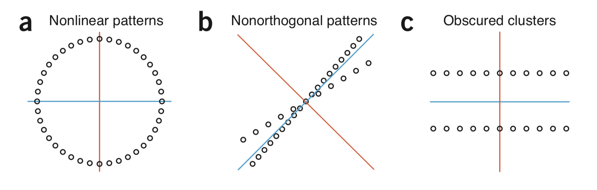

# Single Cell Course 

**Our aim is to extract biologically meaningful insights from scRNA-seq data.**

image source: [Andrews and Hemberg. "Identifying cell populations with scRNASeq." Mol Asp of Med (2018)](https://doi.org/10.1016/j.mam.2017.07.002)

## Dimensionality reduction & visualization 

***Why do we need dimesionality reduction?***

In a scRNA-seq experiment, each cell (sample) is represented with features that are measured values of gene expressions. Thus, number of features (i.e. genes) determines the dimensionality which is around thousands for mammalian samples. Working with high-dimensional samples are difficult for many reasons: 

   + Difficulty in visualization and interpretation
   + Redundant and irrelavant features
   + Curse of dimensionality

"*When comparing cells in a high dimensional gene expression space, distances between cells become more homogenous, making it difficult to distinguish differences between populations from variability within a population.*" [[1]](https://doi.org/10.1016/j.mam.2017.07.002) 

***Curse of dimensionality***

Imagine a 3-class classification problem where we have three types of samples and we will classify them based on a single feature (x axis) [[2]](http://research.cs.tamu.edu/prism/lectures/iss/iss_l10.pdf):

A basic approach can be (one very similar to K-nearest neighbor (knn) idea):

   - divide the feature space into equal bins 
   - compute the number of samples for each class at each bin
   - for a new sample, find its bin and assign the class that has the most number samples in that bin.

[[3]](http://courses.washington.edu/css581/lecture_slides/17_dimensionality_reduction.pdf)
[[4]](http://www.svcl.ucsd.edu/courses/ece271B-F09/handouts/Dimensionality.pdf)

***Feature selection vs feature extraction***

We can reduce dimensions with two approaches [[1]](https://doi.org/10.1016/j.mam.2017.07.002) :

   * **Feature selection:** *filters* irrelevant or redundant features, e.g. uninformative genes, keeping the original features. 
   * **Feature extraction:**  *projects* the data into a low-dimensional space by prioritazing some characteristics of the data (i.e. creating "embeddings"). We no longer have the original features in the embedding. 

Finally, by reducing the dimensions, we can visualize a cell as a point in a two-dimensional space. We also expect to reduce noise and speed up the computational calculations. 

 cells with similar characterisctics will gather close to eacher whereas cells that are different appear apart. 

p.s. I observed that scRNA-seq studies most often use the term 'dimensionality reduction' to refer 'feature extraction'. 

Now we will take a look into three methodologies for dimensionality reduction. 

### Principal Component Analysis (PCA)

#### Background

GOAL: account for variance of data in as few dimensions as possible (using linear projection)
https://www.cs.toronto.edu/~urtasun/courses/CSC411/tutorial8.pdf

[ref](https://www.stat.cmu.edu/~cshalizi/uADA/12/lectures/ch18.pdf)

[math1](http://www.stat.columbia.edu/~fwood/Teaching/w4315/Fall2009/pca.pdf)
[math2](https://www.cs.toronto.edu/~urtasun/courses/CSC411/tutorial8.pdf)

 [ref](http://fortinlab.bio.uci.edu/FortinLab/Teaching_files/Stats/POS_Principal_component_analysis.pdf)

[Qi, Ren, et al. ](https://doi.org/10.1093/bib/bbz062)

#### limitations

image source: [Lever et al. "Principal component analysis." Nat Methods (2017)](https://doi.org/10.1038/nmeth.4346) (a–c) Limitations of PCA are that it may miss nonlinear data patterns (a); structure that is not orthogonal to previous PCs may not be well characterized (b); and PC1 (blue) may not split two obvious clusters (c). PC2 is shown in orange.

#### single cell application

 [ref](https://osca.bioconductor.org/dimensionality-reduction.html)

### t-Distributed Stochastic Neighbor Embedding (t-SNE) 

#### background

[Kobak and Berens. "The art of using t-SNE for single-cell transcriptomics." Nat comm (2019)](https://doi.org/10.1038/s41467-019-13056-x)

 [Qi, Ren, et al. ](https://doi.org/10.1093/bib/bbz062)

#### limitations

### Uniform Manifold Approximation and Projection (UMAP) 

[ref1](https://www.nature.com/articles/nbt.4314)
[ref2](https://www.biorxiv.org/content/10.1101/298430v1.abstract)
[ref3](https://arxiv.org/abs/1802.03426)

## Clustering 

*Why do we need clustering?* 

Clustering is an unsupervised procedure, whose goal is to find homogeneous subgroups among the observations. [Qi, Ren, et al. ](https://doi.org/10.1093/bib/bbz062)

### K-means

http://web.stanford.edu/class/stats202/content/lec24-cond.pdf
http://web.stanford.edu/class/stats202/content/lec4-cond.pdf
https://stanford.edu/~cpiech/cs221/handouts/kmeans.html
https://scilifelab.github.io/courses/scrnaseq/1710/slides/scRNAseq_toolkits_Asa_Bjorklund.pdf

#### background

#### limitations

### Hierarchical clustering

#### background
#### limitations

### Louvain

#### background
#### limitations

